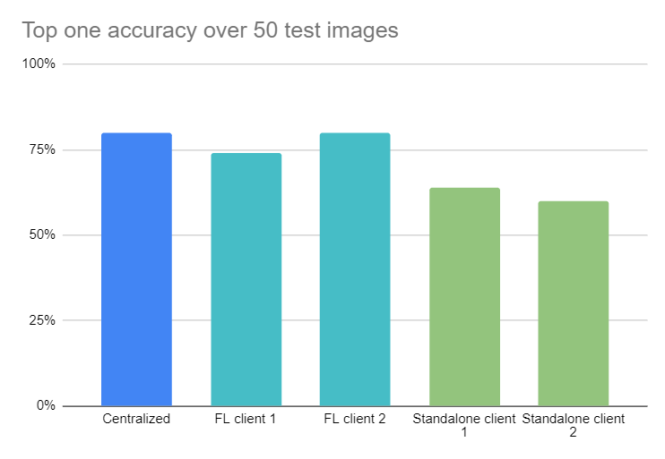

# Federated Learning Classification Benchmark

This repisotary is the official code of the paper "" where we empirically demonstrate how Federated learning (FL) can be used as a collaborative attacking/adversarial strategy to leverage the attacking capabilities of each individual adversary, against an anonymized images dataset, without the need to share/disclose his/her local dataset in a centralized location.

"Add picture"

We build on top of the pytorch implementation provided in [federated_object_detection_benchmark](https://github.com/FederatedAI/FATE/tree/master/research/federated_object_detection_benchmark) and extend the FL process to an image classification task.

We consider that the clients (adversaries) participating in the FL process all exist on the same machine, i.e. the weights between the clients/server are being saved/loaded locally instead of being sent/received between different machines. However the implementation can be extended to work within a distributed environment.

We provide in this repo (1) a FL-based training script, (2) a standalone training script and (3) an inference script/API. Also, all requirmenents are provided via a dockerfile/docker image.

This repository currently works only on Linux with both GPU/CPU usage.

## Prerequisites

* OS:
  * Ubuntu 16.04/18.04
* Docker

### Build the FL Docker Image

In order to build the project run the following command from the project's root directory:

(add dockerfile for cuda9)

#### On GPU (cuda 10)
(add proxy versiion)

```sh
sudo docker build -t fl .
```

#### On CPU

```sh
sudo docker build -f Dockerfile_CPU -t fl .
```
( we should also consider adding our dockerimage on dockerhub)

### Run the FL Docker Container

In order to run the docker container, go to the project's directory and run the following:

#### On GPU

```shell
sudo docker run --runtime=nvidia -itv $(pwd):/app fl
```

#### On CPU

```shell
sudo docker run -e USE_CPU='TRUE' -itv $(pwd):/app fl
```

Inside the running container, navigate to:

```shell
cd /app
```
## Federated Learning Process
### Running the FL server

In order to configure the FL server, please refer to the task.json available in folder /tasks. You can specify FL parameters such as "the number of clients participating in the FL process", "Number of clients that should contact the server at each round ", " the number of FL rounds", ... (usually the MIN_NUM_WORKERS and NUM_CLIENTS_CONTACTED_PER_ROUND should be the same)

```
cat tasks/task.json
```

In order to run the FL server

```
sh ./run_server.sh <dataset_name> <model_name> <port>
```

To check the logs of the server, navigate to

```
cat experiments/logs/0***/<model_name>/<dataset_name>/fl_server.log
```

If you are running the container for the first time, the server will download the pretrained weights of pytorch.

Once the log file indicates that the model is 100% downloaded you can proceed to the next step

The output of the terminal should look like the following when the server is running and ready for the clients:

"Add picture"

### Running the FL clients

Similar to the FL server, each client(i) has a configuration file task(i).json file. Please check the task(i).json files and adjust the corresponding parameters if needed

```
cat tasks/task(1).json
```

The json file have the following fields

```json
{
    "client_number": 1, // number of clients
    "model_name": "ClassificationModelWrapper", //model name
    "log_filename": "classification/faceswap/FL_client_1_log", // log file path
    "n_cpu": 4, // number of cpus to be used
    "local_epoch": 1, // number of local epochs per round
    "batch_size": 4, // batch size
    "Num_classes": 10, // the model's number of classes
    "momentum":0, 
    "data_dir": "dataset/1", // dataset location
    "lr": 1e-5, // learning rate
    "alpha": 0.99,
    "eps": 1e-08,
    "weight_decay": 0,
    "network": "resnet50",
    "personalized_layers": [] // personalized layers depending on your model, i.e. if the model contains an fc layer by specifying 'fc' in the list, the fc layer will not be aggregated at server side
}
```

Each task(i).json file points the client(i) to its corresponding dataset via the <data_dir> field. A dummy datasets for two clients "1" and "2" can be found under the dataset directory

If you are using the container with GPU support, by default you are running all clients on GPU 0. You can change this configuration by accessing run.sh file on line 32, and instead of --gpu $((0)), you can change the 0 to another number incase another GPU is available, or simply set a client to a unique GPU by changing the 0 to ($i-1)

Run the clients

```
sh ./run.sh <dataset_name> <number_of_client> <model_name> <port>
```

The argument "port" should be the same for the server and the clients. 
 
To check client logs

```
cd experiments/logs/0***/fl_client(i)_log
or
cat nohup.out
```

### Stop the FL Process

Once the training is done you should stop the process

```
sh ./stop.sh classification
```

The terminal should look like the following when the FL process is done :
"".

After the FL process is completed, three weight files should be visible:

* Last epoch model
* Best accuracy model
* Best accuracy/loss model

## Standalone training
There's also, separate than the FL workflow, a training script called standalone. This is a standard training script used for benchmarking purposes.
### Running the training script
The training script takes 3 arguments : number_of_classes, number_of_epochs, dataset_dir. Those arguments should be provided in the exact order as mentioned before.

To run the training script, execute the following command:

```
python3 train.py 10 20 /app/dataset/1
```
## Evaluation Inference script
For every trained model, either FL model or standalone model, you can try the inference script to test the trained model. This inference script will use a specified test dataset and a specified model.
### Running the inference script
The inference script takes 2 arguments : dataset_path and model_path. Those arguments should be provided in the exact order as mentioned before.

To run the inference script, execute the following command:
```
python3 bulk_inference.py /app/dataset/1 p_standalone_last_model_3.pth
```

The inference script will output three different models per client

* Last epoch model
* Best accuracy model
* Best accuracy/loss model

alongside the top one accuracy(top_one_accuracy.csv), and the number of recognized labels(individual_eval.csv)
All the needed output can be found in the aforementioned csv files.

ps: If you wish to deploy the inference script as a standalone API, please refer to the following md file : [inference_API](./InferenceAPI.md).

## Results and Benchmark
(We should add the second_phase_no_sharing_BK_Example with dataset, weights, and results)
Our model achieves the following performance on :

"table pic from paper"
For additional details regarding the results of the paper, or the dataset used there, please contact me via 

In the dataset folder, four directories can be found

* 1, the FL client one dataset
* 2, the FL client two dataset
* centralized, the combination of client one and client two data
* test, test images to be used in the inference script

The dataset is IID .
The following chart shows the comparison between multiple trainings.

The first training process is using the centralized dataset, with 40 top one accuracy over 50.

The second and third processes are using the FL benchmark with two clients, respectively with 37 and 40 top one accuracy over 50.

The last two trainings are standalone trainings using client one and client two datasets respectively with 32 and 30 top one accuracy over 50.



The centralized training should always be the most accurate one using the entire dataset, really closely follows the federated learning benchmark, and finally the least accurate standalone models.

## Prerained Weights
